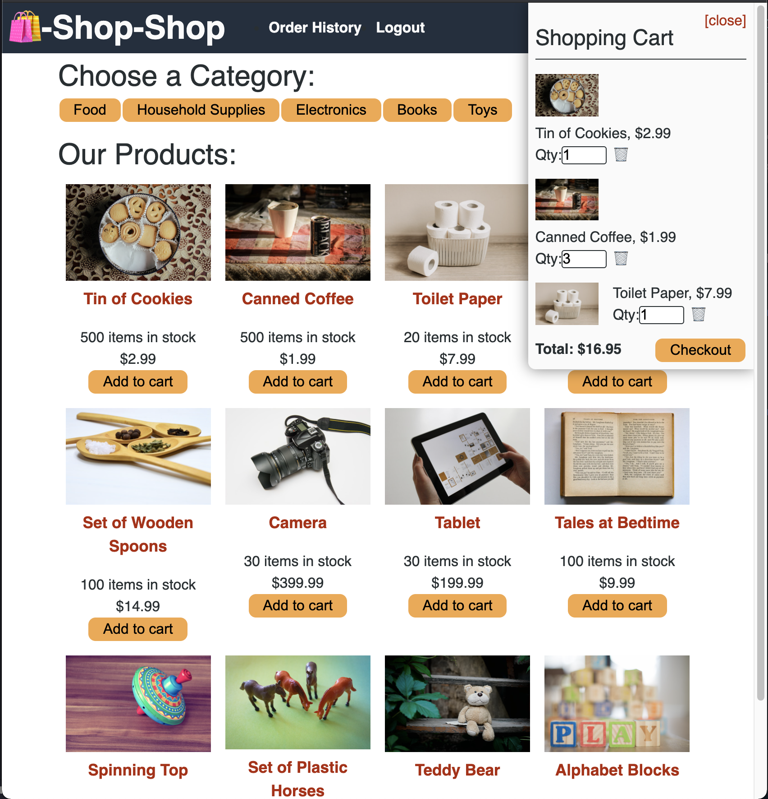

# redux-store

    

## Description

redux-store is an E-Commerce application where users can buy items from several categories of products. This is a MERN stack project which I refactored from using React-Context-API for global state management to using Redux!

## Table of Contents:
* [Installation](#installation)
* [Usage](#usage)
* [Screenshot](#screenshot)
* [Credits](#credits)

## Installation 

This projects development environment uses concurrently to run both the server and client server at the same time from the root directory, if you find the start command does not work from root, try running both the client and server from separate command line tabs. 

## Screenshot

      

## Credits

UT Austin Coding Bootcamp

## License 

MIT
